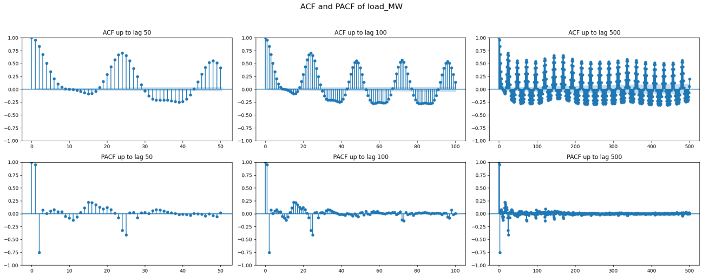
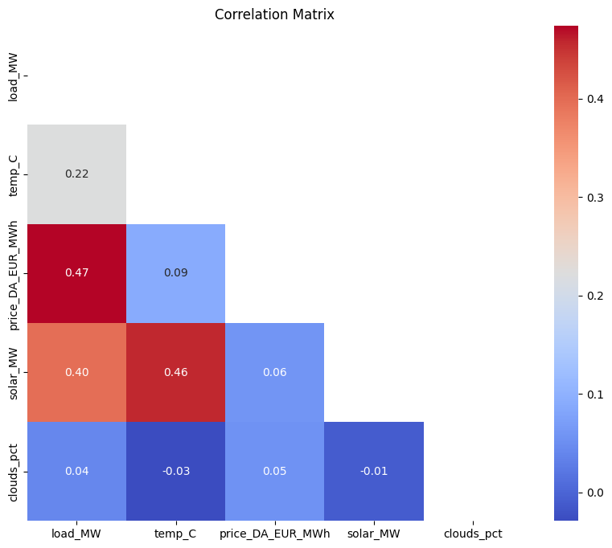

# Multivariate Energy Load Forecasting — VAR vs ARIMA

Time series forecasting of hourly energy demand using Vector Autoregression (VAR) and ARIMA, with full stationarity diagnostics and variable selection via Granger causality.

-brightgreen?style=flat)

---

## At a Glance

| | |
|---|---|
| **Task** | Multivariate time series forecasting |
| **Target** | Hourly energy demand (`load_MW`) — 48-hour forecast horizon |
| **Dataset** | Energy records 2015–2018, 35,064 hourly observations |
| **Libraries** | statsmodels, pandas, numpy, matplotlib, sklearn |
| **Stationarity diagnostics** | ADF test, KPSS test, rolling mean/variance, ACF/PACF |
| **Variable selection** | Granger causality, Cross-Correlation Function (CCF) |
| **Models compared** | VAR(146) vs ARIMA(9,0,8) |
| **Best result** | VAR(146) — MAPE 4.01% vs ARIMA 12.3% |
| **ARIMA search** | 500 configurations, parallelized across 96 vCPUs |

---

## Overview

This report analyzes a multivariate time series dataset containing records of observations between the time periods 2015–2018. The contents can be described as energy-related records. The goal of this report is to find the most optimal parametric model to forecast the last 48 hours of recorded "Load". The series displays strong seasonal patterns, requiring extensive stationarity diagnostics using rolling statistics, ACF/PACF, ADF, and KPSS tests. After identifying suitable transformations, lag and variable analysis are performed using Granger causality and cross-correlation. The report finally compares a univariate ARIMA with a multivariate VAR model.

---

## Dataset

The dataset contains recorded variables load (`load_MW`), temperature (`temp_C`), cloud cover (`cloud_pct`), and price. The target variable is hourly energy demand (`load_MW`), and the primary objective is to identify which independent variables best predict it. Load is measured in megawatts (MW), temperature in degrees Celsius, cloud cover as a percentage (0–100), solar generation in megawatts (MW), and price in euros per megawatt hour (€/MWh). Providing an overview of these units is essential, as their scales directly influence data interpretation.

| Variable | Unit | Description |
|----------|------|-------------|
| `load_MW` | MW | Hourly energy demand **(target)** |
| `temp_C` | °C | Ambient temperature |
| `price_DA_EUR_MWh` | €/MWh | Day-ahead electricity price |
| `solar_MW` | MW | Solar generation |
| `clouds_pct` | % (0–100) | Cloud cover |

Initial inspections of the dataset showed that 54 variables were missing, with 36 in the load column and 18 in the solar column. Because this is an hourly time series, introducing gaps by dropping these values would break the temporal structure. To maintain structure and preserve the hourly frequency, the timestamp column had to be converted to a correct datetime index, and the missing values had to be imputed using time-based interpolation. Interpolation is a technique in time series analysis that estimates missing data points by leveraging surrounding data, thereby imputing values that preserve the natural evolution of the time series (Hyndman and Athanasopoulos 2018). Missing data at such low percentages has little to no effect on the final predictions, making imputation a valid option. After data imputation, the dataset was finalized at **35,064 hourly observations**, providing a complete sequence from January 2015 through December 2018.

---

## Statistics

### Load (MW)
The target variable, Load, has a mean of 28,700 MW and a standard deviation of 4,576 MW. This substantial spread, approximately 16%, indicates potential influence from daily or seasonal fluctuations. The minimum recorded value is 18,041 MW, and the maximum is 41,015 MW. The large variance reflects seasonal fluctuations and variations in demand.

### Temperature
The temperature variable has an average of 17.63°C and a standard deviation of 7.23°C. The minimum recorded temperature is -4.31°C, and the maximum is 38°C, indicating that the dataset originates from a region with a generally warm climate. Since temperature directly affects heating and cooling, the variable is expected to be correlated with load at certain lags.

### Price
The price variable has an average of 49.9 €/MWh and a standard deviation of 14.6, with values ranging from 2.06 to 101.99 €/MWh. Such variability is typical for electricity prices, which are subject to significant fluctuations. Price may contain substantial information about load shifts and direction.

### Solar
Solar generation averages 1.433 MW with a standard deviation of 1.679 MW, ranging from 0 to 5,792 MW. As solar energy is highly influenced by time of day and season, its contribution may be limited once seasonality is considered.

### Clouds
The cloud cover variable has a mean of 20.7%, a standard deviation of 25.6%, and spans the full range from 0% to 100%. Telling us that this variable varies a lot and is hard to predict.

The summary statistics indicate that the dataset contains substantial variations across variables, and this most likely reflects the daily and seasonal patterns common in electricity demand and weather-related observations. Load spans a wide range depending on demand, which is directly linked to heating and cooling periods. Temperature shows variability within cold and warm ranges. Solar generation and cloud cover both vary across large portions of their possible ranges. Price displays considerable volatility, unsurprisingly. All these observations prompt a closer inspection of the underlying distributions.

---

## Distributions

Kernel density estimation (KDE) plots were utilized to further examine the variables. KDE is a non-parametric smoothing technique that reveals the underlying distribution of a variable without assuming a specific distributional form, such as normality (Silverman 1986). This method is particularly valuable in time series analysis, as it provides a visual summary of statistical properties. Additionally, skewness and kurtosis were calculated for each variable to enhance understanding of their distributions.

| Variable | Skewness | Distribution Shape |
|----------|----------|--------------------|
| `load_MW` | 0.062 (low) | Nearly symmetrical, bimodal — likely from seasonal demand fluctuations |
| `temp_C` | 0.038 (low) | Close to symmetrical, bell-shaped, mild kurtosis (2.323) |
| `price` | Mild left skew | Pronounced lower tail — consistent with electricity oversupply dynamics |
| `solar_MW` | Strong right skew | Pronounced daytime peaks |
| `clouds_pct` | Strong right skew | Multimodal, irregular — distinct peaks at ~0%, 30%, 50%, 70% reflecting common weather states |

The KDE analysis shows that the variables differ greatly in their distributional shapes. Some are nearly symmetric, while others exhibit strong skewness or multimodality. The observations indicate that the dataset likely is heterogeneous and non-stationary; however, this only covers the marginal distribution and not how each variable evolves over time. To evaluate trends and seasonal cycles — which are critical to time series forecasting — the analysis has to cover rolling mean and variance properties.

---

## Rolling Statistics and the Need for Scaling

The parametric, linear time-series models (VAR and ARIMA) require underlying data to satisfy key assumptions, the most important of which is stationarity: a time series whose statistical properties don't depend on the time of measurement (Hamilton 1994). It is crucial to ensure a constant mean, variance, and stable autocorrelation structure over time. Failure to comply with these assumptions may lead to spurious correlations in the model's interpretations.

Rolling statistics for mean and variance were calculated to assess trends and changes in variability for each variable. Due to differing scales — load in tens of thousands of megawatts, solar in thousands, temperature in tens, and clouds on a 0–100 scale — the rolling plots were dominated by variables with the largest magnitudes. This scale of disparity also affected direct comparisons of mean and variance across variables.

To address this issue, min-max scaling was applied to each variable prior to plotting rolling statistics. This normalization preserves the structure of each series while enabling direct comparison and interpretation on a common scale (Pedregosa et al. 2011). After scaling, seasonal patterns and shifts in mean values became more apparent.

### Load rolling mean and variance
The rolling mean of the load variable exhibited a recurring annual structure, though with some inconsistency, indicating a non-stationary mean. Seasonal shifts were prominent and repetitive. The variance fluctuated but remained relatively stable over the years. These observations suggest that the series likely violates the stationarity assumption in its mean. Consistently through the summer and fall, through the later months every year, this repeating pattern indicated seasonality in the series. Likewise, the rolling variance of the series followed a seasonal pattern, with higher variance during transitional periods and lower during stable conditions.

### Temperature rolling mean and variance
The rolling mean of temperature shows a very consistent annual cycle, starting low by new year's, peaking in the summer and finishing low in December. The pattern repeats with slight variations, indicating strong seasonality and that the mean is not constant. The variance remains relatively low but varies across the time period. These observations lead to the assumption that temperature most likely is non-stationary.

### Price rolling mean and variance
The price variable exhibited a more irregular pattern. The rolling mean lacked a consistent structure, displaying gradual drifts in certain years and a slight upward trend in 2016 and 2018. This behavior suggests non-stationarity, though it may not be driven by weather-related factors. The variance showed distinguishable spikes, likely corresponding to market shocks, while remaining relatively stable otherwise. Overall, these patterns indicate that the price series is non-stationary.

### Solar rolling mean and variance
Solar generation exhibits the most pronounced seasonal movement after temperature, with its rolling mean and variance closely mirroring the temperature pattern. The rolling mean increases during summer and decreases in winter, reflecting changes in day length. Similarly, variance peaks in summer and declines in winter. These observations indicate that the solar generation series is non-stationary.

### Cloud rolling mean and variance
Cloud is spiky because cloud conditions can change rapidly over short periods. This volatility appears clearly in the rolling variance, which spikes whenever the atmosphere shifts between clear, partly cloudy, and overcast states. Unlike the other weather variables, cloud cover does not follow a clear and consistent seasonal pattern. These abrupt transitions, combined with year-to-year irregularity, make it the most unpredictable of the weather variables.

---

## ACF & PACF

Analysis of rolling mean and variance served as an initial step in assessing stationarity. Earlier results indicated that all variables likely possess a unit root, with means drifting seasonally and variances fluctuating throughout the year. Visual inspection alone is insufficient for conclusive judgement; further analysis using autocorrelation and partial autocorrelation functions (ACF, PACF) is required. ACF and PACF illuminate the memory structure of a series and help determine the extent and type of dependence present (Box, Jenkins, and Reinsel 2008). These functions also reveal the need for, and degree of, differencing required.

### Load
The ACF for the load variable exhibited strong positive autocorrelation, starting near 1 and decaying slowly. A clear pattern emerged at every 24th lag, with this structure persisting up to 500 lags. The PACF showed a prominent spike at lag 1 and weaker, yet noticeable, oscillations at multiples of 24. These findings support the assumption that the load series likely contains a unit root.

### Temperature
The ACF for the temperature series remained consistently high. The plot displayed a repetitive wave structure indicative of a daily cycle. The PACF exhibited a large spike at lag 1, followed by a sequence of oscillations that gradually disappear. There is a clear seasonal daily cycle in the ACF. The PACF has a dominant spike at lag 1, implying a direct AR(1) relationship. The temperature also is seasonal.

### Price
The ACF for price started near one and declines rapidly. However, this decay is not consistent or fast enough to indicate stationarity. A weak repeating pattern can be noticed at multiples of 24, reflecting daily patterns. The ACF also displays weaker, noisier oscillations, potentially reflecting market patterns and daily demand cycles. The PACF indicated short-term dependence, and both ACF and PACF exhibited irregular spikes at multiples of 24. These observations suggest that the price series is likely non-stationary, though not solely due to seasonality even though it is present.

### Solar
The autocorrelation structure of solar seemed to be entirely controlled by the daily structure. Across all lags in the ACF plots, the series shows a clear wave pattern with a repeating phase every 24 lags. The spikes can be seen at lags 24, 48, 72, etc. The correlation between these points drops dramatically, indicating that solar is highly predictable within the daily pattern. The variable holds seasonality and is therefore likely non-stationary.

### Cloud
The cloud cover series exhibited distinct behavior compared to the other variables. Its ACF and PACF indicated erratic patterns with no discernible structure. The ACF decayed rapidly, suggesting minimal short-term dependence on past values, and no cyclical patterns were observed. Among the five variables, cloud cover demonstrated the weakest long-term dependence and the fastest autocorrelation decay, making it the closest to stationarity.

---

## Stationarity Tests (ADF & KPSS)

Visual exploratory analysis revealed clear trends, seasonal cycles, and patterns in most variables. Tools such as rolling mean/variance, ACF/PACF, and KDE suggested the presence of unit roots in several variables. However, visual inspection alone is insufficient for absolute conclusions. To formally assess stationarity and determine the need for further transformation, two complementary tests were employed: the Augmented Dickey-Fuller (ADF) and Kwiatkowski–Phillips–Schmidt–Shin (KPSS) tests.

The ADF test evaluates the presence of a unit root, with rejection of the null hypothesis indicating stationarity (Dickey and Fuller 1979). In contrast, the KPSS test assesses whether a series is stationary around a mean or trend, with rejection implying non-stationarity (Kwiatkowski et al. 1992). Using both tests together provides a robust statistical foundation, as agreement strengthens the conclusion. Disagreement between the tests can guide whether differencing or detrending is required (Schwert 1989).

The ADF and KPSS finalize the assumptions across all variables. Four out of five are found to be non-stationary. The only stationary variable found was cloud percentage. ADF rejected non-stationarity across all variables, and the large test statistics and low p-values on their own back up this claim. This is where it is crucial to have another assessor — in this case, KPSS. KPSS agreed with ADF strictly on cloud and claimed non-stationarity on the rest of the variables across all significance levels.

| Variable | ADF | KPSS | Interpretation | Final Verdict |
|----------|-----|------|----------------|---------------|
| `load_MW` | Stationary (reject H0) | Non-stationary (reject H0) | Conflicting → typical I(1) pattern | Difference stationary → **difference it** |
| `temp_C` | Stationary | Non-stationary | Conflicting → classic borderline trend/cycle | Difference stationary → **difference it** |
| `price` | Stationary | Non-stationary | Same pattern as above | Difference stationary → **difference it** |
| `solar_MW` | Stationary | Non-stationary | ADF stationary, KPSS non-stationary | Difference stationary → **difference it** |
| `clouds_pct` | Stationary | Stationary | Both agree | **Stationary** |

Combined results from the ADF and KPSS tests indicate that load, temperature, price, and solar variables are difference stationary and are predominantly influenced by seasonal structures.

### Optimal Differencing Order

To identify the appropriate differencing order, tests were conducted on four seasonal lags corresponding to the natural cycles observed in the data:

- 24 hours — daily cycle
- 168 hours — weekly cycle
- 672 hours — 4-week cycle
- 8,760 hours — yearly cycle

For each order, KPSS and ADF were used to reassess stationarity and determine whether a unit root was still present. It was discovered that the **24-order differencing**, the smallest, transformed the variables into stationary ones. It was of interest to avoid higher orders or uneven orders to avoid instability and over-differencing of variables (Box, Jenkins, and Reinsel 2008).

| Variable | ADF Result | KPSS | Joint | Final |
|----------|-----------|------|-------|-------|
| `load_MW` | Stationary | Stationary | Both agree | Stationary |
| `temp_C` | Stationary | Stationary | Both agree | Stationary |
| `price` | Stationary | Stationary | Both agree | Stationary |
| `solar_MW` | Stationary | Stationary | Both agree | Stationary |
| `clouds_pct` | Stationary | Stationary | Both agree | Stationary |

---

## Model Selection

Once the relevant variables were rendered stationary, the focus shifted to selecting the optimal model for forecasting the final 48 hours of the Load series. The available modeling options included:

- **Univariate analysis:** The ARIMA model that accesses past load values
- **Multivariate analysis:** VAR model that takes independent variables into account

Prior to differencing, a correlation matrix of the variables' relationships was created. The correlation matrix revealed several moderate relationships among the variables. Load exhibited the strongest linear association with price (0.47), followed by solar (0.4) and temperature (0.22). Cloud cover showed a near-zero correlation with load at 0.22. While these variables may initially appear to influence short-term load behavior, such correlations are largely driven by shared seasonality. Since all variables follow predictable daily and weekly cycles, contemporaneous correlation cannot distinguish genuine predictive relationships from those arising due to synchronized seasonality (Enders 2014).

To address this limitation, two additional tools were employed to capture lag-dependent relationships:

| Limitation of correlation alone | Problem | Consequence |
|----------------------------------|---------|-------------|
| Contemporaneous only | Measures same-time movement only | Cannot detect whether temp/solar predicts load |
| Inflated by seasonality | Shared daily/weekly patterns create artificial correlations | Solar & temp appear predictive but lose significance after differencing |
| Symmetric measure | Cannot distinguish X→Y from Y→X | Cannot tell whether price drives load or vice versa |
| Sensitive to non-stationarity | Trending series correlate even without real linkage | Weather variables look important before differencing, irrelevant after |
| No lag structure | Forecasting requires knowing which lags matter | CCF shows only price retains predictive lagged signal |

Since correlation alone cannot determine which variables most effectively predict load, further assessment was conducted using the cross-correlation function (CCF) and the Granger causality test. It is important to note that both CCF and the Granger causality test assume stationarity (Granger 1969; Lütkepohl 2005). Failure to properly transform the data may result in misleading or spurious outcomes.

### Granger Causality — Does X Granger-cause load_MW?

| Variable | First Significant Lag | Significant Lags | Overall Causality Verdict |
|----------|-----------------------|------------------|---------------------------|
| `temp_C` | Lag 2 | 2, 3, 4, 5 | Weak–Moderate causal effect at short lags |
| `price` | Lag 1 | All lags (1–24) | Very strong and persistent causal effect |
| `solar_MW` | Lag 1 | All lags (1–24) | Causal effect present |
| `clouds_pct` | None | None | No causal effect detected |

### Cross-Correlation Function (CCF)

| Variable | CCF Peak | Peak Lag | Relationship Type | Interpretation |
|----------|----------|----------|-------------------|----------------|
| `temp_C` | -0.039 | Lags 10–14 | Weak negative | Lower temperature → slightly higher load, but very small effect |
| `price` | +0.506 | Lag 0 | Strong positive | High price and high load co-move strongly |
| `solar_MW` | -0.039 | Lags 18–20 | Weak negative | Solar reduces load slightly (logical but effect tiny) |
| `clouds_pct` | -0.018 | Lags 17–20 | Very weak negative | Cloudiness barely relates to load |

The results indicate that, after enforcing stationarity, price and solar variables provide clear and robust predictive information for future changes in load. Temperature offers only weak short-term contributions, while cloud cover demonstrates no predictive value. Consequently, temperature and cloud were excluded from further analysis. As load was found to depend on at least two variables, a multivariate analysis approach was selected as the primary forecasting method.

---

## Optimal VAR Order

To determine the optimal VAR order, a two-phase search strategy was implemented, guided by the seasonal characteristics of the data. The initial phase involved fitting models at seasonal lags of 24 (daily), 168 (weekly), and 720 (monthly). For each candidate, BIC and AIC values were recorded and compared. The daily lag (24) was too short, while the monthly lag (720) was too long. The weekly cycle (168) performed best among these, prompting a more detailed search in neighboring orders. A grid search within the 0–200 range identified the lowest BIC and AIC values at 15.18 and 15.005, respectively. Order **146** was selected because it closely matched the weekly pattern in the data, yielded the lowest BIC (the preferred criterion for large samples), and BIC values increased consistently beyond this point (Schwarz 1978).

---

## Results

### VAR(146)

After model predictions were made, the test and prediction data were transformed back to the original scale using their 48-lag counterparts.

| Metric | Value |
|--------|-------|
| RMSE | 1,313 MW |
| MAE | 1,100 MW |
| **MAPE** | **4.01%** |

The MAPE is the most interpretable metric because the target data have large magnitudes. The 4% error indicates that the model effectively captured the short-term dynamics and patterns. To better understand how forecast accuracy evolves over the 48-hour period, an hour-by-hour comparison of the difference between the prediction and the actual data was made. The pattern revealed that the model was more accurate early on, in the first 6–12 hours. As the range grows, so does the distance between truth and prediction.

### ARIMA(9,0,8)

To evaluate whether a much simpler univariate forecasting model would be able to keep up with the multivariate VAR, the raw load variable was fitted onto an ARIMA model. Because the series becomes stationary at the seasonal differencing order of 24, a grid search was set within the lower search space of orders p, d, q. AIC order 9,0,8 was found as the best performing configuration. Order 9,0,8 stands for 9-order autoregressive, 0 differencing and 8-order moving average. The ARIMA model had to search at a deep level to try to close the gap between it and the VAR.

The ARIMA grid search was computationally heavy because every candidate model requires maximum-likelihood estimation. The search space used in this study contained 500 ARIMA configurations:

- p ∈ [0, 9]
- d ∈ [0, 4]
- q ∈ [0, 9]

On a standard laptop, this search would take at least a day. To make the procedure tractable, all models were evaluated using **parallel processing across 96 vCPUs** on a high compute instance.

| Metric | Value |
|--------|-------|
| RMSE | 4,049 MW |
| MAE | 3,460 MW |
| **MAPE** | **12.3%** |

### Model Comparison

| Model | RMSE | MAE | MAPE |
|-------|------|-----|------|
| **VAR(146)** | **1,313 MW** | **1,100 MW** | **4.01%** |
| ARIMA(9,0,8) | 4,049 MW | 3,460 MW | 12.3% |

---

## Conclusion

The ARIMA(9,0,8) model produced a valid forecast, but its error metrics were substantially worse than those of the VAR model. The univariate analysis shows that a single-variable model cannot capture enough structure in the load series, even when heavily tuned, because it ignores important variables that help explain load. The VAR model consistently outperforms ARIMA by a large margin, both statistically and visually, due to the advantage of incorporating the variables identified earlier as important predictors. The final model choice is therefore the VAR configuration.

---

## References

- Box, G.E.P., and G.M. Jenkins. 1970. *Time Series Analysis: Forecasting and Control.* Holden-Day.
- Box, G.E.P., G.M. Jenkins, and G.C. Reinsel. 2008. *Time Series Analysis.* 4th ed. Wiley.
- Dickey, D.A., and W.A. Fuller. 1979. "Distribution of the Estimators for Autoregressive Time Series With a Unit Root." *JASA* 74(366): 427–431.
- Enders, W. 2014. *Applied Econometric Time Series.* 4th ed. Wiley.
- Granger, C.W.J. 1969. "Investigating Causal Relations by Econometric Models and Cross-Spectral Methods." *Econometrica* 37(3): 424–438.
- Hamilton, J.D. 1994. *Time Series Analysis.* Princeton University Press.
- Hyndman, R.J. 2015. "The State Space Approach to ARIMA Modeling." arXiv:1508.01580.
- Hyndman, R.J., and G. Athanasopoulos. 2018. *Forecasting: Principles and Practice.* OTexts. https://otexts.com/fpp3/
- Kwiatkowski et al. 1992. "Testing the Null Hypothesis of Stationarity." *Journal of Econometrics* 54: 159–178.
- Lütkepohl, H. 2005. *New Introduction to Multiple Time Series Analysis.* Springer.
- Pedregosa et al. 2011. "Scikit-Learn: Machine Learning in Python." *JMLR* 12: 2825–2830.
- Schwarz, G. 1978. "Estimating the Dimension of a Model." *Annals of Statistics* 6(2): 461–464.
- Schwert, G.W. 1989. "Tests for Unit Roots: A Monte Carlo Investigation." *JBES* 7(2): 147–159.
- Silverman, B.W. 1986. *Density Estimation for Statistics and Data Analysis.* Chapman and Hall.
- Wilks, D.S. 2011. *Statistical Methods in the Atmospheric Sciences.* Academic Press.

